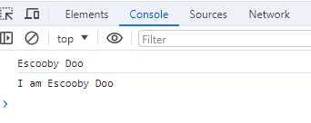

### HTML and JavaScript Basics

**Variables**

Variable dog is assigned the value Escooby Doo. Quotation marks are used to denote strings. Type this in file.js. 

`
let dog = "Escooby Doo";
console.log("I am " + dog);       
`

//prints I am Escooby Doo.

//Concatenation, the + symbol, is used to add strings together. 

Console Prints:

`
Escooby Doo
I am Escooby Doo
`

By running html page and right-clicking mouse button, selecting Inspect, then the cosole viewer, this is what you should see:

Next: (to be completed on next push)

console.log("I am " + dog); //prints I am Escooby Doo. Concatenation, the + symbol, is used to add strings together.

console.log(40 + 8 + 23 - 10);  //prints 50. Addition, the + symbol, is used to add numbers together.

let js = "Amazing";
if (js === "Amazing") alert("JavaScript is lots of fun!");

